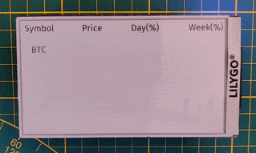

# eInk Crypto Currency

LilyGo EDP47 Crypto currency Tracker


## Prerequisites

Please install first [PlatformIO](http://platformio.org/) open source ecosystem for IoT development compatible with **Arduino** IDE and its command line tools (Windows, MacOs and Linux). Also, you may need to install [git](http://git-scm.com/) in your system.

### WiFi Credentials:

Please first export your WiFi credentials like environment variables, for example

```python
export PIO_WIFI_PASSWORD='MyPassword'
export PIO_WIFI_SSID='MyWifiSSID'
```

### Config:

On `cryptos.h` choose your currencies.  
On `main.cpp` choose the power consumption settings. Try to unchanged these settings maybe for power consumption and possible API usage ban.


## Build and Upload

```bash
pio run --target upload
```


